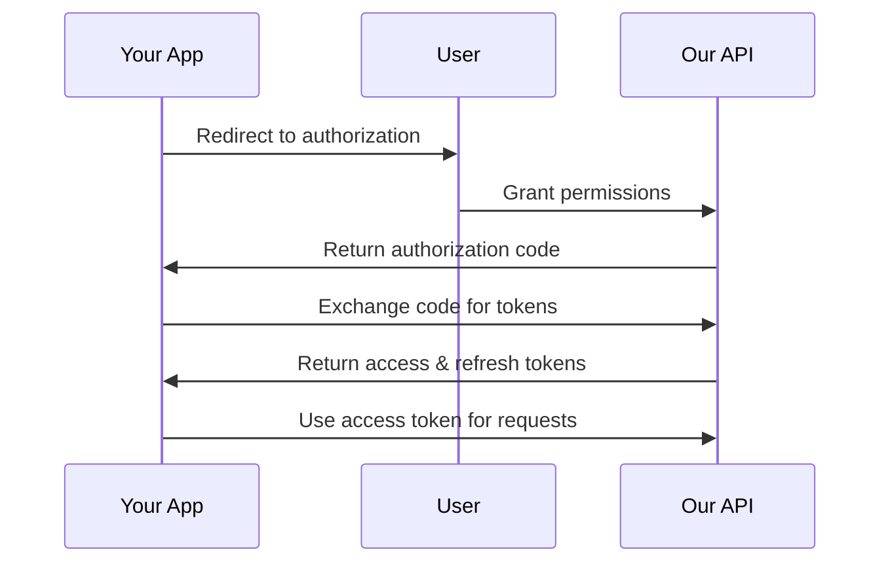

# API Overview

Our REST API provides programmatic access to all platform features. This guide covers authentication, endpoints, and integration patterns.

## 🚀 Quick Start

### Base URL
```
Production: https://api.your-app.com/v1
Staging:    https://api-staging.your-app.com/v1
```

### Authentication
All API requests require authentication using API keys or OAuth 2.0.

```bash
# Using API Key
curl -H "Authorization: Bearer YOUR_API_KEY" \
     https://api.your-app.com/v1/projects

# Using OAuth 2.0
curl -H "Authorization: Bearer YOUR_ACCESS_TOKEN" \
     https://api.your-app.com/v1/projects
```

## 🔐 Authentication

### API Keys (Recommended for Server-to-Server)

#### Creating an API Key
1. Go to Settings → API Keys
2. Click "Create New Key"
3. Give it a descriptive name
4. Select required permissions
5. Copy and store the key securely

#### Using API Keys
```javascript
const response = await fetch('https://api.your-app.com/v1/projects', {
  headers: {
    'Authorization': 'Bearer YOUR_API_KEY',
    'Content-Type': 'application/json'
  }
});
```

### OAuth 2.0 (Recommended for User Applications)

#### Authorization Flow


#### Implementation Example
```javascript
// Step 1: Redirect user to authorization
const authUrl = `https://api.your-app.com/oauth/authorize?` +
  `client_id=${CLIENT_ID}&` +
  `redirect_uri=${REDIRECT_URI}&` +
  `response_type=code&` +
  `scope=read write`;

// Step 2: Exchange code for tokens
const tokenResponse = await fetch('https://api.your-app.com/oauth/token', {
  method: 'POST',
  headers: { 'Content-Type': 'application/json' },
  body: JSON.stringify({
    grant_type: 'authorization_code',
    client_id: CLIENT_ID,
    client_secret: CLIENT_SECRET,
    code: authorizationCode,
    redirect_uri: REDIRECT_URI
  })
});

const { access_token, refresh_token } = await tokenResponse.json();
```

## 📊 API Endpoints

### Core Resources

#### Projects
Manage your projects and deployments.

| Method | Endpoint | Description |
|--------|----------|-------------|
| `GET` | `/projects` | List all projects |
| `POST` | `/projects` | Create a new project |
| `GET` | `/projects/{id}` | Get project details |
| `PUT` | `/projects/{id}` | Update project |
| `DELETE` | `/projects/{id}` | Delete project |

#### Deployments
Track and manage deployments.

| Method | Endpoint | Description |
|--------|----------|-------------|
| `GET` | `/projects/{id}/deployments` | List deployments |
| `POST` | `/projects/{id}/deployments` | Trigger deployment |
| `GET` | `/deployments/{id}` | Get deployment status |
| `POST` | `/deployments/{id}/cancel` | Cancel deployment |

#### Teams
Manage team members and permissions.

| Method | Endpoint | Description |
|--------|----------|-------------|
| `GET` | `/teams` | List teams |
| `POST` | `/teams` | Create team |
| `GET` | `/teams/{id}/members` | List team members |
| `POST` | `/teams/{id}/members` | Add team member |
| `DELETE` | `/teams/{id}/members/{userId}` | Remove team member |

### Detailed Endpoint Documentation

#### GET /projects
List all projects accessible to the authenticated user.

**Parameters:**
- `page` (optional): Page number for pagination (default: 1)
- `limit` (optional): Number of items per page (default: 20, max: 100)
- `status` (optional): Filter by project status (`active`, `archived`)
- `team` (optional): Filter by team ID

**Example Request:**
```bash
curl -H "Authorization: Bearer YOUR_API_KEY" \
     "https://api.your-app.com/v1/projects?page=1&limit=10&status=active"
```

**Example Response:**
```json
{
  "data": [
    {
      "id": "proj_123",
      "name": "My Website",
      "description": "Personal portfolio website",
      "status": "active",
      "created_at": "2024-01-15T10:30:00Z",
      "updated_at": "2024-01-20T14:45:00Z",
      "team": {
        "id": "team_456",
        "name": "My Team"
      },
      "deployments": {
        "total": 15,
        "latest": {
          "id": "deploy_789",
          "status": "success",
          "created_at": "2024-01-20T14:45:00Z"
        }
      }
    }
  ],
  "pagination": {
    "page": 1,
    "limit": 10,
    "total": 25,
    "pages": 3
  }
}
```

#### POST /projects
Create a new project.

**Request Body:**
```json
{
  "name": "My New Project",
  "description": "Project description",
  "template": "blank",
  "visibility": "private",
  "team_id": "team_456"
}
```

**Example Request:**
```bash
curl -X POST \
     -H "Authorization: Bearer YOUR_API_KEY" \
     -H "Content-Type: application/json" \
     -d '{
       "name": "My New Project",
       "description": "A new project",
       "template": "blank",
       "visibility": "private"
     }' \
     https://api.your-app.com/v1/projects
```

**Example Response:**
```json
{
  "data": {
    "id": "proj_124",
    "name": "My New Project",
    "description": "A new project",
    "status": "active",
    "created_at": "2024-01-21T09:15:00Z",
    "updated_at": "2024-01-21T09:15:00Z",
    "deployments": {
      "total": 0,
      "latest": null
    }
  }
}
```

## 🔄 Webhooks

Webhooks allow you to receive real-time notifications about events in your projects.

### Setting Up Webhooks

#### Create a Webhook
```bash
curl -X POST \
     -H "Authorization: Bearer YOUR_API_KEY" \
     -H "Content-Type: application/json" \
     -d '{
       "url": "https://your-app.com/webhooks/deployments",
       "events": ["deployment.started", "deployment.completed", "deployment.failed"],
       "secret": "your-webhook-secret"
     }' \
     https://api.your-app.com/v1/webhooks
```

#### Webhook Events
- `deployment.started`: Deployment begins
- `deployment.completed`: Deployment succeeds
- `deployment.failed`: Deployment fails
- `project.created`: New project created
- `project.updated`: Project settings changed
- `team.member_added`: Team member added

#### Webhook Payload Example
```json
{
  "id": "evt_123",
  "type": "deployment.completed",
  "created_at": "2024-01-21T10:30:00Z",
  "data": {
    "deployment": {
      "id": "deploy_789",
      "project_id": "proj_123",
      "status": "success",
      "url": "https://my-project.your-app.com",
      "created_at": "2024-01-21T10:25:00Z",
      "completed_at": "2024-01-21T10:30:00Z"
    }
  }
}
```

## 📝 SDKs and Libraries

### Official SDKs

#### JavaScript/Node.js
```bash
npm install @your-app/api-client
```

```javascript
import { YourAppClient } from '@your-app/api-client';

const client = new YourAppClient({
  apiKey: 'YOUR_API_KEY'
});

// List projects
const projects = await client.projects.list();

// Create a project
const project = await client.projects.create({
  name: 'My Project',
  template: 'blank'
});

// Deploy a project
const deployment = await client.deployments.create(project.id);
```

#### Python
```bash
pip install your-app-api
```

```python
from your_app_api import YourAppClient

client = YourAppClient(api_key='YOUR_API_KEY')

# List projects
projects = client.projects.list()

# Create a project
project = client.projects.create(
    name='My Project',
    template='blank'
)

# Deploy a project
deployment = client.deployments.create(project.id)
```

#### PHP
```bash
composer require your-app/api-client
```

```php
use YourApp\ApiClient;

$client = new ApiClient('YOUR_API_KEY');

// List projects
$projects = $client->projects()->list();

// Create a project
$project = $client->projects()->create([
    'name' => 'My Project',
    'template' => 'blank'
]);

// Deploy a project
$deployment = $client->deployments()->create($project->id);
```

## 🚨 Error Handling

### HTTP Status Codes

| Code | Description |
|------|-------------|
| `200` | Success |
| `201` | Created |
| `400` | Bad Request |
| `401` | Unauthorized |
| `403` | Forbidden |
| `404` | Not Found |
| `422` | Validation Error |
| `429` | Rate Limited |
| `500` | Internal Server Error |

### Error Response Format
```json
{
  "error": {
    "code": "validation_error",
    "message": "The request data is invalid",
    "details": [
      {
        "field": "name",
        "message": "Name is required"
      }
    ]
  }
}
```

### Rate Limiting
- **Free Plan**: 100 requests per hour
- **Pro Plan**: 1,000 requests per hour
- **Enterprise**: Custom limits

Rate limit headers:
```
X-RateLimit-Limit: 1000
X-RateLimit-Remaining: 999
X-RateLimit-Reset: 1640995200
```

## 🧪 Testing

### Sandbox Environment
Use our sandbox environment for testing:
```
Base URL: https://api-sandbox.your-app.com/v1
```

### Postman Collection
Import our Postman collection for easy testing:
[Download Collection](https://api.your-app.com/postman-collection.json)

### Example Test Script
```javascript
// Test API connectivity
const testConnection = async () => {
  try {
    const response = await fetch('https://api.your-app.com/v1/health');
    const data = await response.json();
    console.log('API Status:', data.status);
  } catch (error) {
    console.error('Connection failed:', error);
  }
};
```

## 📚 Additional Resources

### Documentation
- [Authentication Guide](/docs/api/authentication)
- [Webhooks Guide](/docs/api/webhooks)
- [SDK Documentation](/docs/api/sdks)
- [Rate Limits](/docs/api/rate-limits)

### Support
- **API Support**: api-support@your-app.com
- **Status Page**: [status.your-app.com](https://status.your-app.com)
- **Community Forum**: [community.your-app.com](https://community.your-app.com)

### Changelog
- [API Changelog](/docs/api/changelog)
- [SDK Updates](/docs/api/sdk-changelog)

---

*API version: v1 | Last updated: 2024-01-21*
