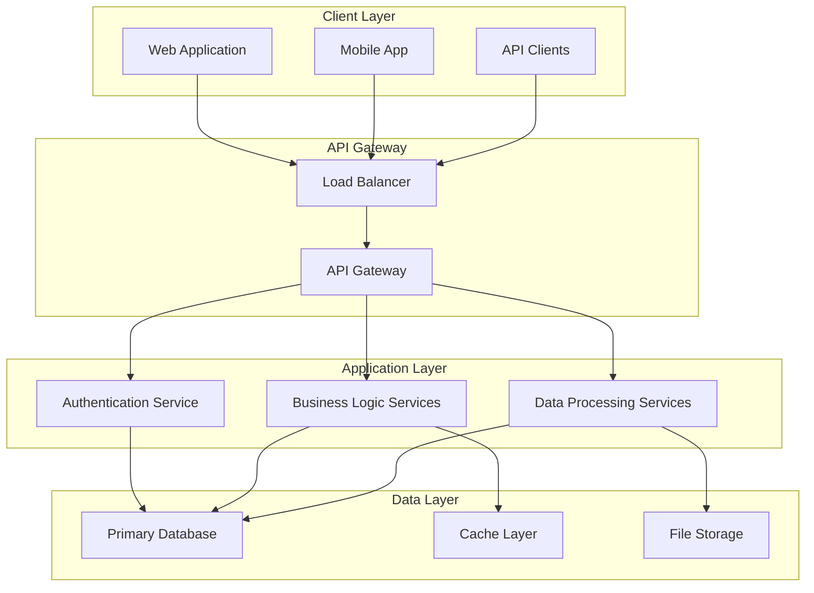

# System Architecture Overview

## 🎯 System Purpose

The Quantum development platform is designed to provide a comprehensive, secure, and well-organized development environment that follows industry best practices. The system focuses on:

- **Developer Productivity**: Streamlined workflows and clear documentation
- **Security First**: Azure Key Vault integration for secrets management
- **Workspace Organization**: Structured project layouts and coding standards
- **Documentation Excellence**: Multi-audience documentation system
- **Operational Excellence**: Monitoring, deployment, and maintenance procedures

## 🏗️ High-Level Architecture

## 🧩 Core Components

### Client Layer
- **Web Application**: React-based frontend for desktop users
- **Mobile App**: Native mobile applications for iOS/Android
- **API Clients**: Third-party integrations and SDKs

### API Gateway
- **Load Balancer**: Distributes traffic across multiple instances
- **API Gateway**: Handles routing, authentication, and rate limiting

### Application Services
- **Authentication Service**: User management and security
- **Business Logic Services**: Core application functionality
- **Data Processing Services**: Background processing and analytics

### Data Layer
- **Primary Database**: PostgreSQL for transactional data
- **Cache Layer**: Redis for performance optimization
- **File Storage**: Azure Blob Storage for media and documents

## 🔄 Data Flow

### User Request Flow
1. **Client** sends request to API Gateway
2. **Load Balancer** routes to available instance
3. **API Gateway** validates authentication and rate limits
4. **Application Service** processes business logic
5. **Data Layer** stores/retrieves data
6. **Response** flows back through the same path

### Background Processing Flow
1. **Events** trigger background jobs
2. **Message Queue** manages job distribution
3. **Processing Services** handle async tasks
4. **Results** stored in database or cache

## 🎨 Design Principles

### Scalability
- **Horizontal Scaling**: Stateless services for easy scaling
- **Microservices**: Independent services for targeted scaling
- **Caching**: Multiple cache layers for performance

### Reliability
- **Fault Tolerance**: Circuit breakers and retry mechanisms
- **Health Checks**: Continuous monitoring of service health
- **Graceful Degradation**: System continues with reduced functionality

### Security
- **Zero Trust**: Verify every request
- **Encryption**: Data encrypted in transit and at rest
- **Access Control**: Role-based permissions and audit logging

### Maintainability
- **Modular Design**: Clear separation of concerns
- **API-First**: Well-defined interfaces between components
- **Documentation**: Comprehensive documentation for all components

## 📊 Technology Stack

### Frontend
- **Framework**: React 18 with TypeScript
- **State Management**: Redux Toolkit
- **UI Library**: Material-UI
- **Build Tool**: Vite

### Backend
- **Runtime**: Node.js with TypeScript
- **Framework**: Express.js
- **Authentication**: JWT with refresh tokens
- **Validation**: Joi for request validation

### Database
- **Primary**: PostgreSQL 14
- **Cache**: Redis 7
- **Search**: Elasticsearch 8
- **File Storage**: Azure Blob Storage

### Infrastructure
- **Containerization**: Docker
- **Orchestration**: Kubernetes
- **CI/CD**: GitHub Actions
- **Monitoring**: Prometheus + Grafana

## 🚀 Deployment Architecture

### Environments
- **Development**: Local development with Docker Compose
- **Staging**: Production-like environment for testing
- **Production**: High-availability cluster deployment

### Deployment Strategy
- **Blue-Green**: Zero-downtime deployments
- **Canary**: Gradual rollout of new features
- **Rollback**: Quick rollback capability for issues

## 📈 Performance Considerations

### Response Times
- **API Endpoints**: < 200ms for 95th percentile
- **Database Queries**: < 100ms for simple queries
- **Cache Hit Rate**: > 90% for frequently accessed data

### Throughput
- **Concurrent Users**: Support for 10,000+ concurrent users
- **API Requests**: Handle 100,000+ requests per minute
- **Data Processing**: Process millions of records per hour

### Optimization Strategies
- **Database Indexing**: Optimized indexes for common queries
- **Query Optimization**: Efficient SQL and NoSQL queries
- **Caching Strategy**: Multi-level caching for performance
- **CDN**: Global content delivery for static assets

## 🔒 Security Architecture

### Authentication & Authorization
- **Multi-Factor Authentication**: Required for admin access
- **Role-Based Access Control**: Granular permissions
- **Session Management**: Secure session handling
- **API Security**: Rate limiting and request validation

### Data Protection
- **Encryption**: AES-256 for data at rest
- **TLS**: TLS 1.3 for data in transit
- **Key Management**: Azure Key Vault for secret management
- **Data Masking**: Sensitive data protection in logs

### Network Security
- **Firewall**: Network-level protection
- **VPN**: Secure access for admin operations
- **DDoS Protection**: Cloudflare protection
- **Intrusion Detection**: Continuous monitoring

## 📋 Monitoring & Observability

### Metrics
- **Application Metrics**: Response times, error rates, throughput
- **Infrastructure Metrics**: CPU, memory, disk, network
- **Business Metrics**: User activity, feature usage, conversions

### Logging
- **Structured Logging**: JSON format for easy parsing
- **Log Aggregation**: Centralized log collection
- **Log Retention**: 90 days for application logs
- **Audit Logging**: Security and compliance logging

### Alerting
- **Critical Alerts**: Immediate notification for system issues
- **Warning Alerts**: Proactive notification for potential issues
- **Escalation**: Automatic escalation for unacknowledged alerts
- **On-Call**: 24/7 on-call rotation for production issues

## 🔄 Evolution & Roadmap

### Current Version
- **Version**: 2.1.0
- **Release Date**: [Current Date]
- **Key Features**: [List current features]

### Upcoming Features
- **Version 2.2.0**: [Planned features]
- **Version 3.0.0**: [Major architectural changes]

### Migration Strategy
- **Backward Compatibility**: Maintain API compatibility
- **Gradual Migration**: Phased rollout of changes
- **Data Migration**: Automated data migration tools
- **Rollback Plan**: Quick rollback for issues

---

*This architecture document is reviewed quarterly and updated as the system evolves.*
