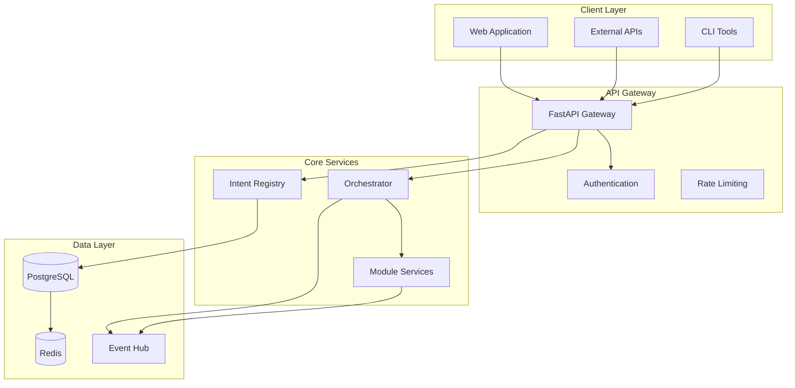
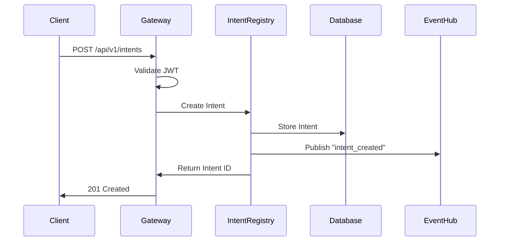
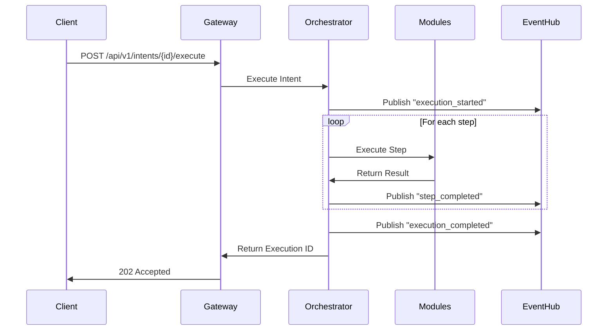

# Quantum Platform Architecture Tutorial

Welcome to the comprehensive architecture tutorial for Quantum Platform. This guide will walk you through the core concepts, components, and how they work together to create a powerful intent-driven orchestration system.

## Table of Contents

1. [System Overview](#system-overview)
2. [Core Components](#core-components)
3. [Data Flow](#data-flow)
4. [Intent Processing](#intent-processing)
5. [Multi-Tenant Architecture](#multi-tenant-architecture)
6. [Security Model](#security-model)
7. [Hands-On Examples](#hands-on-examples)

## System Overview

Quantum Platform is built on a modern, cloud-native architecture that separates concerns into distinct layers:



## Core Components

### 1. API Gateway

The API Gateway serves as the single entry point for all client requests.

**Key Responsibilities:**
- Request routing and load balancing
- Authentication and authorization
- Rate limiting and throttling
- Request/response transformation
- OpenAPI documentation

**Example Request Flow:**
```python
# Client makes request
POST /api/v1/intents
Authorization: Bearer <jwt_token>
Content-Type: application/json

{
  "name": "deploy-application",
  "definition": {
    "target": "production",
    "version": "1.2.3",
    "environment": "azure-westus"
  }
}

# Gateway processes:
# 1. Validates JWT token
# 2. Checks rate limits
# 3. Routes to Intent Registry
# 4. Returns response
```

### 2. Intent Registry

The Intent Registry is the central store for all intent definitions and their versions.

**Key Features:**
- Intent CRUD operations
- Version management and rollback
- Validation and schema enforcement
- Search and discovery
- Audit trail

**Example Intent Definition:**
```json
{
  "id": "deploy-application-v1",
  "name": "deploy-application",
  "version": 1,
  "tenant_id": "tenant-123",
  "definition": {
    "target": "production",
    "steps": [
      {
        "action": "build-container",
        "image": "myapp:1.2.3"
      },
      {
        "action": "deploy-to-kubernetes",
        "namespace": "production"
      },
      {
        "action": "verify-deployment",
        "health_check": "/health"
      }
    ]
  },
  "status": "active",
  "created_at": "2024-01-04T10:00:00Z"
}
```

### 3. Orchestrator

The Orchestrator is the workflow execution engine that processes intents.

**Key Features:**
- Intent execution planning
- Workflow orchestration
- Error handling and retry logic
- Progress tracking
- Event publishing

**Example Orchestration Flow:**
```python
async def execute_intent(intent_id: str, tenant_id: str):
    # 1. Load intent definition
    intent = await intent_registry.get(intent_id, tenant_id)
    
    # 2. Create execution plan
    plan = create_execution_plan(intent.definition)
    
    # 3. Execute steps
    for step in plan.steps:
        try:
            result = await execute_step(step)
            await publish_event("step_completed", result)
        except Exception as e:
            await handle_error(step, e)
            break
    
    # 4. Complete execution
    await publish_event("intent_completed", plan.id)
```

## Data Flow

Understanding how data flows through the system is crucial for effective development.

### 1. Intent Creation Flow



### 2. Intent Execution Flow



## Intent Processing

Intents are processed through a sophisticated pipeline that ensures reliability and scalability.

### 1. Intent Validation

```python
class IntentValidator:
    def validate(self, intent: IntentDefinition) -> ValidationResult:
        # Schema validation
        schema_result = self.validate_schema(intent.definition)
        if not schema_result.valid:
            return ValidationResult(valid=False, errors=schema_result.errors)
        
        # Business logic validation
        business_result = self.validate_business_rules(intent)
        if not business_result.valid:
            return ValidationResult(valid=False, errors=business_result.errors)
        
        # Security validation
        security_result = self.validate_security(intent)
        if not security_result.valid:
            return ValidationResult(valid=False, errors=security_result.errors)
        
        return ValidationResult(valid=True)
```

### 2. Execution Planning

```python
class ExecutionPlanner:
    def create_plan(self, intent: IntentDefinition) -> ExecutionPlan:
        plan = ExecutionPlan(intent_id=intent.id)
        
        for step_definition in intent.definition.steps:
            step = ExecutionStep(
                action=step_definition.action,
                parameters=step_definition.parameters,
                dependencies=self.calculate_dependencies(step_definition),
                timeout=step_definition.timeout or 300
            )
            plan.add_step(step)
        
        return plan
```

## Multi-Tenant Architecture

Quantum Platform provides enterprise-grade tenant isolation through multiple layers.

### 1. Row-Level Security (RLS)

```sql
-- Enable RLS on intents table
ALTER TABLE intents ENABLE ROW LEVEL SECURITY;

-- Create policy for tenant isolation
CREATE POLICY tenant_isolation ON intents
    FOR ALL TO app_user
    USING (tenant_id = current_setting('app.current_tenant_id')::uuid);

-- Set tenant context
SET app.current_tenant_id = 'tenant-123';
```

### 2. Attribute-Based Access Control (ABAC)

```python
class ABACPolicy:
    def check_permission(self, user: User, resource: Resource, action: str) -> bool:
        # Get user attributes
        user_attrs = self.get_user_attributes(user)
        
        # Get resource attributes
        resource_attrs = self.get_resource_attributes(resource)
        
        # Evaluate policy
        return self.evaluate_policy(user_attrs, resource_attrs, action)

# Example policy evaluation
policy = ABACPolicy()
can_execute = policy.check_permission(
    user=user,
    resource=intent,
    action="execute"
)
```

## Security Model

Quantum Platform implements a comprehensive security model with multiple layers of protection.

### 1. Authentication

```python
class AuthenticationService:
    async def authenticate(self, token: str) -> User:
        # Validate JWT token
        payload = jwt.decode(token, SECRET_KEY, algorithms=["HS256"])
        
        # Check token expiration
        if payload["exp"] < time.time():
            raise AuthenticationError("Token expired")
        
        # Get user from database
        user = await self.get_user(payload["user_id"])
        if not user:
            raise AuthenticationError("User not found")
        
        return user
```

### 2. Authorization

```python
class AuthorizationService:
    def check_permission(self, user: User, resource: str, action: str) -> bool:
        # Check role-based permissions
        if self.has_role_permission(user, resource, action):
            return True
        
        # Check attribute-based permissions
        if self.has_abac_permission(user, resource, action):
            return True
        
        return False
```

## Hands-On Examples

### Example 1: Creating Your First Intent

Let's create a simple intent that deploys an application:

```python
# 1. Define the intent
intent_definition = {
    "name": "deploy-web-app",
    "definition": {
        "target": "production",
        "steps": [
            {
                "action": "build-docker-image",
                "image": "myapp:latest",
                "context": "./app"
            },
            {
                "action": "push-to-registry",
                "registry": "azurecr.io",
                "image": "myapp:latest"
            },
            {
                "action": "deploy-to-kubernetes",
                "namespace": "production",
                "replicas": 3
            }
        ]
    }
}

# 2. Create the intent
response = await client.post("/api/v1/intents", json=intent_definition)
intent_id = response.json()["id"]

# 3. Execute the intent
execution = await client.post(f"/api/v1/intents/{intent_id}/execute")
execution_id = execution.json()["execution_id"]
```

### Example 2: Monitoring Intent Execution

```python
# Monitor execution progress
async def monitor_execution(execution_id: str):
    async for event in client.stream(f"/api/v1/executions/{execution_id}/events"):
        if event["type"] == "step_completed":
            print(f"Step {event['step']} completed: {event['result']}")
        elif event["type"] == "execution_completed":
            print(f"Execution {execution_id} completed successfully")
            break
        elif event["type"] == "execution_failed":
            print(f"Execution {execution_id} failed: {event['error']}")
            break
```

### Example 3: Multi-Tenant Intent Management

```python
# Switch tenant context
client.set_tenant("tenant-123")

# Create intent for specific tenant
intent = await client.post("/api/v1/intents", json=intent_definition)

# List intents for current tenant
intents = await client.get("/api/v1/intents")

# Execute intent (automatically scoped to tenant)
execution = await client.post(f"/api/v1/intents/{intent['id']}/execute")
```

## Best Practices

### 1. Intent Design

- **Keep intents focused**: Each intent should have a single, clear purpose
- **Use descriptive names**: Intent names should clearly indicate their purpose
- **Version your intents**: Always version your intent definitions
- **Test thoroughly**: Test intents in development before production

### 2. Error Handling

- **Implement retries**: Use exponential backoff for transient failures
- **Log everything**: Comprehensive logging helps with debugging
- **Graceful degradation**: Handle partial failures gracefully
- **Monitor execution**: Set up alerts for failed executions

### 3. Performance

- **Optimize queries**: Use proper indexing and query optimization
- **Cache frequently**: Cache frequently accessed data
- **Batch operations**: Batch multiple operations when possible
- **Monitor metrics**: Track performance metrics and optimize accordingly

## Next Steps

Now that you understand the architecture, here's what to explore next:

1. **Try the Quick Start Guide**: Get hands-on experience with the platform
2. **Explore the API Reference**: Learn about all available endpoints
3. **Read the Design System**: Understand the UI/UX guidelines
4. **Check out the Blueprints**: See real-world application examples

## Support

Need help with the architecture or have questions?

- **Documentation**: [Complete API Reference](/docs/api-reference/overview)
- **GitHub**: [View Source Code](https://github.com/centrex-ai/quantum-platform)
- **Issues**: [Report Issues](https://github.com/centrex-ai/quantum-platform/issues)
- **Discussions**: [Community Discussions](https://github.com/centrex-ai/quantum-platform/discussions)

---

*This tutorial is part of the Quantum Platform documentation. For the latest updates, visit our [GitHub repository](https://github.com/centrex-ai/quantum-platform-docs).*
