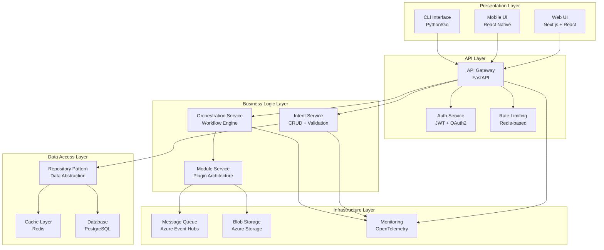

# Application Blueprint

The Quantum Platform Application Blueprint defines the complete application architecture, design patterns, and implementation guidelines for building intent-driven orchestration systems.

## Blueprint Overview

This blueprint serves as the definitive guide for:
- **Application Architecture**: System design and component relationships
- **Design Patterns**: Reusable patterns for common scenarios
- **Implementation Guidelines**: Best practices and standards
- **Quality Gates**: Non-functional requirements and validation criteria

## Application Architecture

### Core Application Stack



## Design Patterns

### 1. Intent-Driven Pattern

**Purpose**: Enable declarative system behavior through intent specifications

**Implementation**:
```python
class Intent:
    def __init__(self, tenant_id: str, name: str, definition: dict):
        self.tenant_id = tenant_id
        self.name = name
        self.definition = definition
        self.status = IntentStatus.DRAFT
        self.version = 1
    
    def validate(self) -> ValidationResult:
        """Validate intent definition against schema"""
        pass
    
    def execute(self) -> ExecutionResult:
        """Execute intent through orchestrator"""
        pass
```

**Benefits**:
- Declarative configuration
- Self-documenting code
- Easy testing and validation
- Version control friendly

### 2. Repository Pattern

**Purpose**: Abstract data access and provide a clean interface for data operations

**Implementation**:
```python
class IntentRepository:
    def __init__(self, db: AsyncSession):
        self.db = db
    
    async def create(self, intent: Intent) -> Intent:
        """Create new intent"""
        pass
    
    async def get_by_id(self, intent_id: str) -> Optional[Intent]:
        """Get intent by ID"""
        pass
    
    async def get_by_tenant(self, tenant_id: str) -> List[Intent]:
        """Get all intents for tenant"""
        pass
    
    async def update(self, intent: Intent) -> Intent:
        """Update existing intent"""
        pass
    
    async def delete(self, intent_id: str) -> bool:
        """Delete intent"""
        pass
```

**Benefits**:
- Data access abstraction
- Testability
- Database independence
- Consistent interface

### 3. Orchestrator Pattern

**Purpose**: Coordinate complex workflows and manage execution state

**Implementation**:
```python
class WorkflowOrchestrator:
    def __init__(self, intent_registry: IntentRegistry, module_registry: ModuleRegistry):
        self.intent_registry = intent_registry
        self.module_registry = module_registry
    
    async def execute_intent(self, intent_id: str) -> ExecutionResult:
        """Execute intent through workflow orchestration"""
        intent = await self.intent_registry.get(intent_id)
        workflow = self.create_workflow(intent)
        return await self.execute_workflow(workflow)
    
    def create_workflow(self, intent: Intent) -> Workflow:
        """Create workflow from intent definition"""
        pass
    
    async def execute_workflow(self, workflow: Workflow) -> ExecutionResult:
        """Execute workflow with error handling and retry logic"""
        pass
```

**Benefits**:
- Workflow management
- Error handling and recovery
- Progress tracking
- Scalability

### 4. Module Plugin Pattern

**Purpose**: Enable extensible business logic through pluggable modules

**Implementation**:
```python
class ModuleInterface(ABC):
    @abstractmethod
    async def execute(self, context: ExecutionContext) -> ModuleResult:
        """Execute module logic"""
        pass
    
    @abstractmethod
    def get_capabilities(self) -> List[Capability]:
        """Return module capabilities"""
        pass

class ModuleRegistry:
    def __init__(self):
        self.modules: Dict[str, ModuleInterface] = {}
    
    def register(self, name: str, module: ModuleInterface):
        """Register module"""
        self.modules[name] = module
    
    def get(self, name: str) -> Optional[ModuleInterface]:
        """Get module by name"""
        return self.modules.get(name)
```

**Benefits**:
- Extensibility
- Modularity
- Testability
- Reusability

## Application Components

### 1. API Gateway Service

**Purpose**: Central entry point for all client requests

**Key Responsibilities**:
- Request routing and load balancing
- Authentication and authorization
- Rate limiting and throttling
- Request/response transformation
- API documentation generation

**Configuration**:
```python
# FastAPI application setup
app = FastAPI(
    title="Quantum Platform API",
    version="1.0.0",
    openapi_url="/api/v1/openapi.json",
    docs_url="/api/v1/docs",
    redoc_url="/api/v1/redoc",
    middleware=[
        Middleware(CORSMiddleware, allow_origins=["*"]),
        Middleware(TrustedHostMiddleware, allowed_hosts=["*"]),
    ]
)

# Authentication middleware
@app.middleware("http")
async def auth_middleware(request: Request, call_next):
    # JWT token validation
    pass

# Rate limiting middleware
@app.middleware("http")
async def rate_limit_middleware(request: Request, call_next):
    # Redis-based rate limiting
    pass
```

### 2. Intent Registry Service

**Purpose**: Central storage and management of intent definitions

**Key Responsibilities**:
- Intent CRUD operations
- Version management and rollback
- Validation and schema enforcement
- Search and discovery
- Audit trail and change tracking

**Data Model**:
```python
class Intent(BaseModel):
    id: UUID
    tenant_id: UUID
    name: str
    version: int
    definition: Dict[str, Any]
    status: IntentStatus
    created_at: datetime
    updated_at: datetime
    created_by: str
    updated_by: str

class IntentStatus(str, Enum):
    DRAFT = "draft"
    ACTIVE = "active"
    DEPRECATED = "deprecated"
    ARCHIVED = "archived"
```

### 3. Orchestration Service

**Purpose**: Workflow execution and orchestration engine

**Key Responsibilities**:
- Intent execution planning
- Workflow orchestration
- Error handling and retry logic
- Progress tracking and monitoring
- Event-driven processing

**Workflow Definition**:
```python
class Workflow(BaseModel):
    id: UUID
    intent_id: UUID
    steps: List[WorkflowStep]
    status: WorkflowStatus
    started_at: Optional[datetime]
    completed_at: Optional[datetime]
    error: Optional[str]

class WorkflowStep(BaseModel):
    id: str
    module: str
    parameters: Dict[str, Any]
    dependencies: List[str]
    retry_policy: RetryPolicy
    timeout: int
```

### 4. Module Services

**Purpose**: Domain-specific business logic implementation

**Key Responsibilities**:
- Business logic execution
- External system integration
- Data transformation
- Event publishing
- Health monitoring

**Module Interface**:
```python
class ModuleInterface(ABC):
    @abstractmethod
    async def execute(self, context: ExecutionContext) -> ModuleResult:
        """Execute module logic"""
        pass
    
    @abstractmethod
    def get_capabilities(self) -> List[Capability]:
        """Return module capabilities"""
        pass
    
    @abstractmethod
    def get_health_status(self) -> HealthStatus:
        """Return module health status"""
        pass
```

## Data Architecture

### Database Design

**Primary Database**: PostgreSQL 15+ with Row-Level Security

**Key Tables**:
```sql
-- Tenants table
CREATE TABLE tenants (
    id UUID PRIMARY KEY,
    name VARCHAR(255) NOT NULL,
    domain VARCHAR(255) UNIQUE NOT NULL,
    status VARCHAR(50) NOT NULL,
    created_at TIMESTAMP DEFAULT NOW(),
    updated_at TIMESTAMP DEFAULT NOW()
);

-- Intents table
CREATE TABLE intents (
    id UUID PRIMARY KEY,
    tenant_id UUID NOT NULL REFERENCES tenants(id),
    name VARCHAR(255) NOT NULL,
    version INTEGER NOT NULL,
    definition JSONB NOT NULL,
    status VARCHAR(50) NOT NULL,
    created_at TIMESTAMP DEFAULT NOW(),
    updated_at TIMESTAMP DEFAULT NOW(),
    UNIQUE(tenant_id, name, version)
);

-- Workflows table
CREATE TABLE workflows (
    id UUID PRIMARY KEY,
    intent_id UUID NOT NULL REFERENCES intents(id),
    status VARCHAR(50) NOT NULL,
    started_at TIMESTAMP,
    completed_at TIMESTAMP,
    error_message TEXT,
    created_at TIMESTAMP DEFAULT NOW()
);

-- Modules table
CREATE TABLE modules (
    id UUID PRIMARY KEY,
    tenant_id UUID NOT NULL REFERENCES tenants(id),
    name VARCHAR(255) NOT NULL,
    version VARCHAR(50) NOT NULL,
    capabilities JSONB NOT NULL,
    status VARCHAR(50) NOT NULL,
    created_at TIMESTAMP DEFAULT NOW(),
    updated_at TIMESTAMP DEFAULT NOW()
);
```

**Row-Level Security Policies**:
```sql
-- Enable RLS on all tables
ALTER TABLE intents ENABLE ROW LEVEL SECURITY;
ALTER TABLE workflows ENABLE ROW LEVEL SECURITY;
ALTER TABLE modules ENABLE ROW LEVEL SECURITY;

-- Tenant isolation policies
CREATE POLICY tenant_isolation_intents ON intents
    FOR ALL TO app_user
    USING (tenant_id = current_setting('app.current_tenant_id')::uuid);

CREATE POLICY tenant_isolation_workflows ON workflows
    FOR ALL TO app_user
    USING (intent_id IN (
        SELECT id FROM intents 
        WHERE tenant_id = current_setting('app.current_tenant_id')::uuid
    ));
```

### Caching Strategy

**Redis**: Multi-layer caching for performance

**Cache Layers**:
1. **Session Cache**: User sessions and authentication tokens
2. **Query Cache**: Database query results
3. **API Cache**: API response caching
4. **Rate Limit Cache**: Rate limiting counters

**Cache Configuration**:
```python
# Redis configuration
redis_config = {
    "host": "localhost",
    "port": 6379,
    "db": 0,
    "decode_responses": True,
    "socket_connect_timeout": 5,
    "socket_timeout": 5,
    "retry_on_timeout": True,
    "health_check_interval": 30
}

# Cache decorator
def cache_result(expiry: int = 300):
    def decorator(func):
        async def wrapper(*args, **kwargs):
            cache_key = f"{func.__name__}:{hash(str(args) + str(kwargs))}"
            cached = await redis.get(cache_key)
            if cached:
                return json.loads(cached)
            
            result = await func(*args, **kwargs)
            await redis.setex(cache_key, expiry, json.dumps(result))
            return result
        return wrapper
    return decorator
```

## Security Architecture

### Authentication

**Azure Active Directory**: Enterprise identity provider
**JWT Tokens**: Stateless authentication
**Multi-Factor Authentication**: Enhanced security

**Authentication Flow**:
```python
class AuthService:
    def __init__(self, azure_ad_client: AzureADClient):
        self.azure_ad_client = azure_ad_client
    
    async def authenticate(self, token: str) -> AuthResult:
        """Authenticate user with JWT token"""
        try:
            payload = jwt.decode(token, options={"verify_signature": False})
            user_info = await self.azure_ad_client.get_user_info(payload["sub"])
            return AuthResult(success=True, user=user_info)
        except Exception as e:
            return AuthResult(success=False, error=str(e))
    
    async def authorize(self, user: User, resource: str, action: str) -> bool:
        """Authorize user action on resource"""
        permissions = await self.get_user_permissions(user.id)
        return f"{resource}:{action}" in permissions
```

### Authorization

**Role-Based Access Control (RBAC)**: User and service roles
**Attribute-Based Access Control (ABAC)**: Fine-grained permissions
**Resource-Level Permissions**: Granular access control

**Permission Model**:
```python
class Permission(BaseModel):
    resource: str
    action: str
    conditions: Dict[str, Any]

class Role(BaseModel):
    name: str
    permissions: List[Permission]
    inherits_from: Optional[str]

class User(BaseModel):
    id: str
    email: str
    roles: List[str]
    attributes: Dict[str, Any]
```

## Quality Gates

### Performance Requirements

- **API Response Time**: < 200ms (95th percentile)
- **Throughput**: 10,000 requests/second per service
- **Database**: < 50ms query response time
- **Availability**: 99.9% uptime SLA

### Security Requirements

- **Authentication**: All requests authenticated
- **Authorization**: Fine-grained permission checking
- **Encryption**: Data protected in transit and at rest
- **Audit Logging**: Complete activity tracking

### Reliability Requirements

- **Fault Tolerance**: Circuit breakers and retries
- **Disaster Recovery**: Multi-region deployment
- **Backup Strategy**: Daily automated backups
- **Recovery Time**: < 15 minutes MTTR

## Implementation Guidelines

### Code Standards

1. **Type Safety**: Use type hints throughout
2. **Error Handling**: Comprehensive error handling
3. **Logging**: Structured logging with correlation IDs
4. **Testing**: Unit, integration, and E2E tests
5. **Documentation**: Comprehensive API documentation

### Development Workflow

1. **Feature Branch**: Create feature branch from main
2. **Development**: Implement feature with tests
3. **Code Review**: Peer review and approval
4. **Testing**: Automated testing pipeline
5. **Deployment**: Automated deployment to staging
6. **Production**: Blue-green deployment to production

### Monitoring and Observability

1. **Metrics**: Application and business metrics
2. **Logging**: Structured logging with correlation IDs
3. **Tracing**: Distributed tracing across services
4. **Alerting**: Proactive alerting on issues
5. **Dashboards**: Real-time monitoring dashboards

## Next Steps

1. **Review Blueprint**: Understand the application architecture
2. **Setup Development Environment**: Get started with local development
3. **Implement Core Services**: Build the foundational services
4. **Add Module Plugins**: Extend functionality with modules
5. **Deploy to Production**: Deploy to production environment

---

*This blueprint provides the foundation for building robust, scalable, and maintainable intent-driven applications.*
