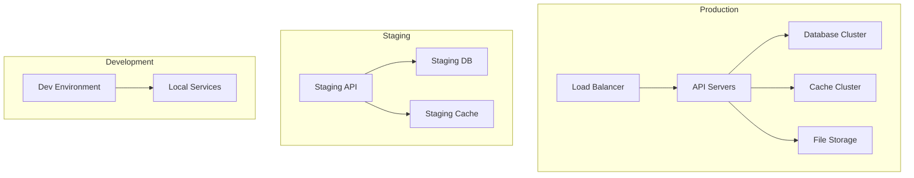
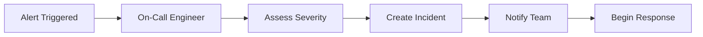

# Operations Overview

This guide covers all operational aspects of our platform, including deployment procedures, monitoring, incident response, and maintenance tasks.

## 🎯 Operations Philosophy

### Core Principles
- **Reliability First**: 99.9% uptime target
- **Automated Operations**: Minimize manual intervention
- **Proactive Monitoring**: Detect issues before they impact users
- **Fast Recovery**: Quick incident response and resolution
- **Continuous Improvement**: Learn from incidents and optimize

### Service Level Objectives (SLOs)
- **Availability**: 99.9% uptime (8.77 hours downtime per year)
- **Response Time**: 95th percentile < 200ms
- **Error Rate**: < 0.1% of requests
- **Deployment Success**: > 99% successful deployments

## 🏗️ Infrastructure Architecture

### Environment Overview



### Production Infrastructure
- **Compute**: Kubernetes cluster with auto-scaling
- **Database**: PostgreSQL with read replicas
- **Cache**: Redis cluster with persistence
- **Storage**: Azure Blob Storage with CDN
- **Monitoring**: Prometheus + Grafana + AlertManager

## 🚀 Deployment Procedures

### Deployment Strategy

#### Blue-Green Deployment
1. **Prepare Green Environment**
   - Deploy new version to green environment
   - Run health checks and smoke tests
   - Verify database migrations

2. **Switch Traffic**
   - Update load balancer to point to green
   - Monitor for 5 minutes
   - Verify metrics and error rates

3. **Cleanup**
   - Keep blue environment for 24 hours
   - Archive blue environment after verification

#### Canary Deployment
1. **Deploy to Canary**
   - Deploy to 5% of traffic
   - Monitor for 30 minutes
   - Check error rates and performance

2. **Gradual Rollout**
   - Increase to 25% if metrics are good
   - Monitor for 30 minutes
   - Increase to 50%, then 100%

3. **Rollback if Needed**
   - Automatic rollback on error rate increase
   - Manual rollback via deployment dashboard

### Deployment Checklist

#### Pre-Deployment
- [ ] All tests pass (unit, integration, e2e)
- [ ] Security scan completed
- [ ] Performance tests pass
- [ ] Database migrations tested
- [ ] Configuration updated
- [ ] Monitoring alerts configured
- [ ] Rollback plan prepared

#### During Deployment
- [ ] Deploy to staging first
- [ ] Run smoke tests on staging
- [ ] Deploy to production
- [ ] Monitor deployment progress
- [ ] Verify health checks pass
- [ ] Check error rates and performance

#### Post-Deployment
- [ ] Monitor for 30 minutes
- [ ] Verify all systems operational
- [ ] Update documentation
- [ ] Notify stakeholders
- [ ] Archive old deployment

### Automated Deployment Pipeline

```yaml
# .github/workflows/deploy.yml
name: Deploy to Production

on:
  push:
    branches: [main]

jobs:
  deploy:
    runs-on: ubuntu-latest
    steps:
      - uses: actions/checkout@v3
      
      - name: Run Tests
        run: |
          npm test
          npm run test:integration
          npm run test:e2e
      
      - name: Security Scan
        run: npm audit
      
      - name: Build Application
        run: npm run build
      
      - name: Deploy to Staging
        run: |
          kubectl apply -f k8s/staging/
          kubectl rollout status deployment/api-staging
      
      - name: Run Smoke Tests
        run: npm run test:smoke:staging
      
      - name: Deploy to Production
        run: |
          kubectl apply -f k8s/production/
          kubectl rollout status deployment/api-production
      
      - name: Verify Deployment
        run: npm run test:smoke:production
```

## 📊 Monitoring and Alerting

### Monitoring Stack

#### Metrics Collection
- **Prometheus**: Metrics collection and storage
- **Grafana**: Visualization and dashboards
- **Node Exporter**: System metrics
- **Application Metrics**: Custom business metrics

#### Logging
- **Fluentd**: Log collection and forwarding
- **Elasticsearch**: Log storage and indexing
- **Kibana**: Log visualization and analysis
- **Log Aggregation**: Centralized logging

#### Tracing
- **Jaeger**: Distributed tracing
- **OpenTelemetry**: Instrumentation
- **Performance Monitoring**: Request tracing

### Key Metrics to Monitor

#### Application Metrics
- **Response Time**: P50, P95, P99 percentiles
- **Error Rate**: 4xx and 5xx error percentages
- **Throughput**: Requests per second
- **Active Users**: Concurrent user count

#### Infrastructure Metrics
- **CPU Usage**: Per service and overall
- **Memory Usage**: RAM consumption
- **Disk Usage**: Storage utilization
- **Network**: Bandwidth and latency

#### Business Metrics
- **User Registrations**: New user signups
- **Feature Usage**: Feature adoption rates
- **Revenue Metrics**: Subscription and usage
- **Customer Satisfaction**: Support ticket volume

### Alerting Rules

#### Critical Alerts (PagerDuty)
- **Service Down**: Any service unavailable
- **High Error Rate**: > 5% error rate for 5 minutes
- **Database Issues**: Connection failures or slow queries
- **Security Incidents**: Unusual access patterns

#### Warning Alerts (Slack)
- **High Response Time**: P95 > 500ms for 10 minutes
- **Resource Usage**: CPU > 80% for 15 minutes
- **Deployment Issues**: Failed deployments
- **Certificate Expiry**: SSL certificates expiring soon

#### Example Alert Configuration
```yaml
# prometheus/alerts.yml
groups:
  - name: application
    rules:
      - alert: HighErrorRate
        expr: rate(http_requests_total{status=~"5.."}[5m]) > 0.05
        for: 5m
        labels:
          severity: critical
        annotations:
          summary: "High error rate detected"
          description: "Error rate is {{ $value }} errors per second"
      
      - alert: HighResponseTime
        expr: histogram_quantile(0.95, rate(http_request_duration_seconds_bucket[5m])) > 0.5
        for: 10m
        labels:
          severity: warning
        annotations:
          summary: "High response time"
          description: "95th percentile response time is {{ $value }}s"
```

## 🚨 Incident Response

### Incident Classification

#### Severity Levels
- **P1 - Critical**: Service completely down, data loss
- **P2 - High**: Major feature unavailable, performance degraded
- **P3 - Medium**: Minor feature issues, non-critical bugs
- **P4 - Low**: Cosmetic issues, enhancement requests

#### Response Times
- **P1**: 15 minutes response, 1 hour resolution
- **P2**: 1 hour response, 4 hours resolution
- **P3**: 4 hours response, 24 hours resolution
- **P4**: 24 hours response, 1 week resolution

### Incident Response Process

#### 1. Detection and Triage


#### 2. Response Actions
1. **Acknowledge Alert**: Confirm receipt and assessment
2. **Create Incident**: Document in incident management system
3. **Assemble Team**: Gather necessary responders
4. **Investigate**: Identify root cause and impact
5. **Communicate**: Update stakeholders and users
6. **Resolve**: Implement fix and verify resolution
7. **Post-Mortem**: Document lessons learned

#### 3. Communication Templates

**Initial Alert (Slack)**
```
🚨 INCIDENT ALERT
Severity: P1 - Critical
Service: API Gateway
Issue: Service unavailable
Impact: All users affected
ETA: Investigating
On-Call: @engineer-name
```

**Status Update**
```
📊 INCIDENT UPDATE
Incident: #INC-2024-001
Status: Investigating
Progress: Identified database connection issue
ETA: 30 minutes
Next Update: 15 minutes
```

**Resolution**
```
✅ INCIDENT RESOLVED
Incident: #INC-2024-001
Duration: 45 minutes
Root Cause: Database connection pool exhausted
Resolution: Increased connection pool size
Post-Mortem: Scheduled for tomorrow 2 PM
```

### On-Call Procedures

#### On-Call Rotation
- **Primary**: 24/7 coverage, 1 week rotation
- **Secondary**: Backup for primary, escalation path
- **Escalation**: Senior engineers for complex issues

#### On-Call Responsibilities
- **Monitor Alerts**: Respond to all P1/P2 alerts
- **Incident Response**: Lead incident response process
- **Communication**: Keep stakeholders informed
- **Documentation**: Update incident records

## 🔧 Maintenance Procedures

### Regular Maintenance Tasks

#### Daily Tasks
- [ ] Check system health dashboards
- [ ] Review overnight alerts and incidents
- [ ] Verify backup completion
- [ ] Check certificate expiration dates
- [ ] Review security logs

#### Weekly Tasks
- [ ] Update dependencies and security patches
- [ ] Review performance metrics and trends
- [ ] Clean up old logs and temporary files
- [ ] Test disaster recovery procedures
- [ ] Review capacity planning metrics

#### Monthly Tasks
- [ ] Security vulnerability assessment
- [ ] Performance optimization review
- [ ] Disaster recovery testing
- [ ] Documentation updates
- [ ] Capacity planning review

### Database Maintenance

#### Daily
- [ ] Monitor database performance
- [ ] Check for long-running queries
- [ ] Verify backup completion
- [ ] Review connection pool usage

#### Weekly
- [ ] Analyze query performance
- [ ] Update database statistics
- [ ] Review and optimize indexes
- [ ] Clean up old data

#### Monthly
- [ ] Database version updates
- [ ] Schema optimization
- [ ] Capacity planning
- [ ] Security audit

### Security Maintenance

#### Daily
- [ ] Review security alerts
- [ ] Check for unusual access patterns
- [ ] Monitor failed login attempts
- [ ] Review API usage patterns

#### Weekly
- [ ] Update security patches
- [ ] Review access logs
- [ ] Test security controls
- [ ] Update firewall rules

#### Monthly
- [ ] Security vulnerability scan
- [ ] Access review and cleanup
- [ ] Security policy updates
- [ ] Penetration testing

## 📈 Performance Optimization

### Performance Monitoring

#### Key Performance Indicators
- **Response Time**: API endpoint performance
- **Throughput**: Requests per second capacity
- **Resource Utilization**: CPU, memory, disk usage
- **Database Performance**: Query execution times

#### Performance Testing
```bash
# Load testing with k6
k6 run --vus 100 --duration 5m load-test.js

# Stress testing
k6 run --vus 500 --duration 10m stress-test.js

# Spike testing
k6 run --vus 1000 --duration 2m spike-test.js
```

### Optimization Strategies

#### Application Optimization
- **Caching**: Implement multi-level caching
- **Database**: Optimize queries and indexes
- **CDN**: Use content delivery network
- **Compression**: Enable gzip compression

#### Infrastructure Optimization
- **Auto-scaling**: Scale based on demand
- **Load Balancing**: Distribute traffic efficiently
- **Resource Allocation**: Right-size instances
- **Network Optimization**: Optimize network paths

## 🔄 Backup and Disaster Recovery

### Backup Strategy

#### Data Backups
- **Database**: Daily full backups, hourly incremental
- **File Storage**: Real-time replication
- **Configuration**: Version-controlled in Git
- **Secrets**: Encrypted in Azure Key Vault

#### Backup Retention
- **Daily Backups**: 30 days retention
- **Weekly Backups**: 12 weeks retention
- **Monthly Backups**: 12 months retention
- **Yearly Backups**: 7 years retention

### Disaster Recovery Plan

#### Recovery Time Objectives (RTO)
- **Critical Systems**: 1 hour
- **Important Systems**: 4 hours
- **Standard Systems**: 24 hours

#### Recovery Point Objectives (RPO)
- **Critical Data**: 15 minutes
- **Important Data**: 1 hour
- **Standard Data**: 24 hours

#### Recovery Procedures
1. **Assess Damage**: Determine scope of disaster
2. **Activate DR Site**: Switch to backup infrastructure
3. **Restore Data**: Restore from latest backups
4. **Verify Systems**: Test all critical functions
5. **Communicate**: Notify stakeholders of status
6. **Monitor**: Watch for issues during recovery

## 📋 Operational Checklists

### Deployment Checklist
- [ ] Code review completed
- [ ] Tests passing
- [ ] Security scan passed
- [ ] Performance tests passed
- [ ] Database migrations ready
- [ ] Configuration updated
- [ ] Monitoring configured
- [ ] Rollback plan ready
- [ ] Team notified
- [ ] Deployment executed
- [ ] Health checks passed
- [ ] Monitoring verified

### Incident Response Checklist
- [ ] Alert acknowledged
- [ ] Incident created
- [ ] Team assembled
- [ ] Severity assessed
- [ ] Investigation started
- [ ] Stakeholders notified
- [ ] Root cause identified
- [ ] Fix implemented
- [ ] Resolution verified
- [ ] Communication sent
- [ ] Post-mortem scheduled

### Maintenance Checklist
- [ ] Health checks completed
- [ ] Alerts reviewed
- [ ] Backups verified
- [ ] Security logs checked
- [ ] Performance metrics reviewed
- [ ] Dependencies updated
- [ ] Documentation updated
- [ ] Capacity planning reviewed

---

*This operations guide is reviewed monthly and updated based on lessons learned and system evolution.*
