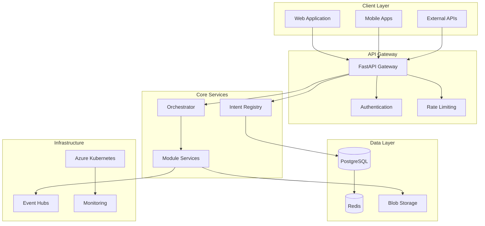

# Quantum Platform

  

    <h1 className="hero-title">Intent-Driven Orchestration</h1>
    

      Enterprise-scale platform that transforms how organizations build, deploy, and manage complex systems through declarative intent specifications.
    

    

      <a href="/docs/getting-started" className="button button--primary button--lg">
        Get Started
      </a>
      <a href="/docs/architecture/overview" className="button button--secondary button--lg">
        View Architecture
      </a>
    

  

## What is Quantum Platform?

Quantum Platform is a next-generation orchestration system designed for enterprise-scale deployment. Built on the principle of **intent-driven architecture**, it enables organizations to declare what they want to achieve rather than how to achieve it.

### Core Philosophy

> **"Declare intent, not implementation"**

Instead of writing procedural code, you define declarative intents that describe the desired state of your system. The platform then orchestrates the necessary actions to achieve that state.

## Key Features

  

    
🎯

    <h3>Intent-Driven Architecture</h3>
    
Define system behavior through declarative intent specifications rather than imperative code.

  

  
  

    
🏢

    <h3>Multi-Tenant Isolation</h3>
    
Enterprise-grade tenant isolation with Row-Level Security and Attribute-Based Access Control.

  

  
  

    
🔒

    <h3>Zero-Trust Security</h3>
    
Comprehensive security model with authentication, authorization, and audit logging at every layer.

  

  
  

    
☁️

    <h3>Cloud-Native Design</h3>
    
Built for Azure with auto-scaling, self-healing, and infrastructure as code capabilities.

  

  
  

    
⚡

    <h3>High Performance</h3>
    
Sub-200ms API response times with horizontal scaling and intelligent caching.

  

  
  

    
🔧

    <h3>Developer Experience</h3>
    
Comprehensive APIs, SDKs, and tooling for seamless integration and development.

  

## Architecture Overview

## Use Cases

### Enterprise Integration
- **Legacy System Modernization**: Gradually modernize legacy systems through intent-driven wrappers
- **Multi-Cloud Orchestration**: Manage resources across multiple cloud providers
- **Compliance Automation**: Automate compliance workflows and reporting

### Development Teams
- **Microservices Orchestration**: Coordinate complex microservices architectures
- **CI/CD Pipeline Management**: Orchestrate build, test, and deployment processes
- **Feature Flag Management**: Control feature rollouts across environments

### Operations Teams
- **Infrastructure Automation**: Automate infrastructure provisioning and management
- **Incident Response**: Orchestrate incident response and recovery procedures
- **Capacity Management**: Automatically scale resources based on demand

## Getting Started

Ready to transform your organization's approach to system orchestration?

  <h2>Start Building Today</h2>
  
Join the future of intent-driven development

  

    <a href="/docs/getting-started" className="button button--primary button--lg">
      Quick Start Guide
    </a>
    <a href="/docs/api-reference" className="button button--secondary button--lg">
      API Reference
    </a>
  

## Community & Support

- **GitHub**: [quantum-platform](https://github.com/Dylan-Natter/quantum-platform)
- **Discord**: Join our community discussions
- **Documentation**: Comprehensive guides and references
- **Support**: Enterprise support available

---

*Quantum Platform is built with ❤️ by the Centrex team*
